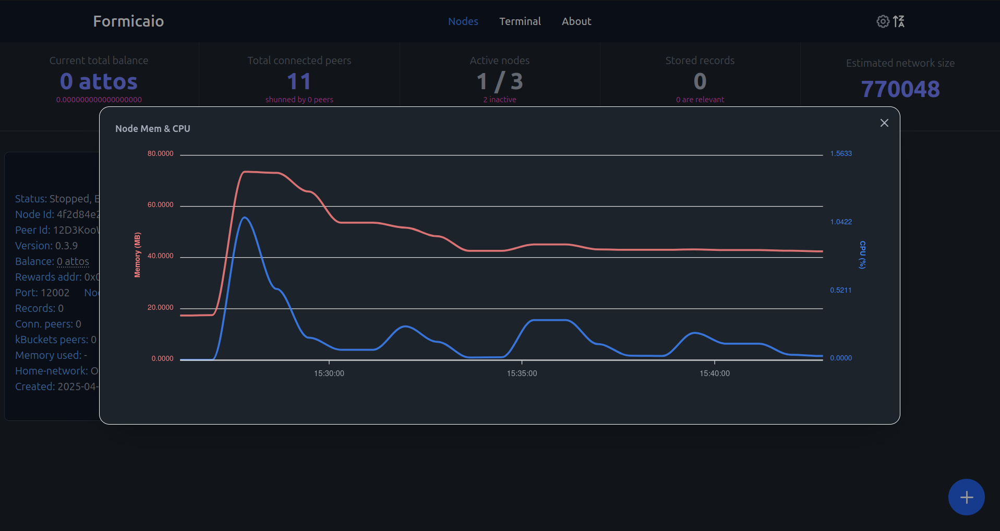

# Formicaio - Node Management for the Autonomi Network

> *Le formiche sono insetti sociali che vivono in colonie e sono note per la loro organizzazione e cooperazione.*
> 
> Ants are social insects that live in colonies and are known for their organization and cooperation.


## Table of Contents

- [Introduction](#introduction)
- [Features](#features)
- [Installation & Deployment](#installation--deployment)
  - [Native Executable](#native-executable)
  - [UmbrelOS](#umbrelos)
  - [CasaOS](#casaos)
  - [Docker](#docker)
  - [Podman](#podman)
- [LCD Display Support](#lcd-display-support)
- [Configuration](#configuration)
- [Disclaimer](#disclaimer)
- [License](#license)

## Introduction

### Simplify your decentralized experience with Formicaio

Formicaio is an intuitive application designed to help you run and manage nodes on the [Autonomi](https://autonomi.com) network. This P2P network allows users to share storage and bandwidth in exchange for ANT tokens, an ERC-20 token on the Arbitrum One network.

The name "Formicaio" is derived from the Italian word for "anthill", symbolizing the collaborative and structured nature of both ants and the decentralized network it supports. Just as ants work together to build and maintain their colonies, Formicaio empowers users to collaborate and contribute to the Autonomi network.

### What is Autonomi?

Autonomi is a decentralized storage and bandwidth sharing network where users can earn ANT tokens by contributing their resources. The network operates on Arbitrum One, providing fast and cost-effective transactions. (https://forum.autonomi.community/t/formicaio)

## Features

### 🚀 Node Management Made Easy

With Formicaio, you can easily run and manage nodes using either a graphical user interface (GUI) or a terminal. This flexibility allows you to perform various actions on individual nodes or groups of selected nodes:

- **Create new nodes** with customizable settings
- **Start or stop nodes** individually or in batches
- **Recycle nodes** to generate new peer IDs
- **Remove nodes** when no longer needed
- **Upgrade nodes** when new binary versions are available
- **View individual node logs** in real-time
- **Monitor memory and CPU usage** with detailed charts
- **Sort nodes** by different criteria (creation date, status, connected peers, etc.)


### 📊 Real-time Monitoring & Statistics

The Formicaio backend actively monitors your nodes, providing real-time status updates and comprehensive statistics:

- **Rewards balance** for each node
- **Memory and CPU usage** tracking
- **Number of records** stored locally
- **Current peer connections** count
- **Peers in routing table** (k-buckets)
- **Shunned peers** tracking
- **Estimated total nodes** in the network




### ⚙️ Customizable Settings

A comprehensive settings panel allows you to customize monitoring tasks and node management:

- **Auto-upgrade nodes** when new binary versions are available
- **Configurable delays** for node upgrades
- **Version check frequency** for the node binary
- **Token balance query frequency**
- **Metrics retrieval frequency**
- **ERC20 token contract configuration** (address and RPC URL)
- **LCD display configuration** for external monitoring


### 🌐 Network Connectivity Options

When setting up nodes, you can define their connection type and custom data directory:

- **UPnP support**: Attempts to use UPnP to open a port on your home router for incoming connections. If your router doesn't support UPnP, create nodes with UPnP disabled to ensure connectivity.
- **Listening IP address**: This address determines which network interface the node will bind to for incoming connections. The application supports both IPv4 (e.g., `0.0.0.0`, `127.0.0.1`) and IPv6 (e.g., `::`, `fe80::1`) addresses, allowing users to control whether the node is accessible on all interfaces, only locally, or on a specific network. This flexibility is useful for running nodes in different environments, such as local development, private networks, or public-facing deployments.
- **Custom data directory**: This directory is where the node will store its persistent data, such as chunks, logs, and configuration files. By assigning a unique data directory to each node, or batch of nodes, users can run multiple nodes on the same machine without data conflicts. This option is especially valuable for advanced setups or when running nodes with different hard disks or mounting points.


### MCP Server for Integration with AI Agents

The MCP server of Formicaio is designed to seamlessly integrate with any AI agent. This flexibility allows users to leverage the capabilities of various AI models with Formicaio. To illustrate this integration, check out the video demonstration below that showcases how the MCP server can be effectively combined with [n8n](https://n8n.io), an open-source workflow automation tool. 

The video highlights the simplicity of connecting Formicaio with AI agents to automate tasks and streamline processes. You can see the integration in action using [n8n](https://n8n.io). We interact with Formicaio through an AI agent via chat, as well as demonstrate how to schedule a task that monitors CPU usage. Based on the detected CPU capacity on the host, the system can automatically request Formicaio to add or remove nodes, ensuring optimal performance. This is the AI prompt used in this showcase:
```text
Make sure the CPU usage on the host is below 50%. If it is, add a new node
instance on Formicaio with the same properties as the existing nodes, using a
port number that is one higher than the highest current port. Also, keep the
total number of nodes to 3; if there are more than 3, remove the extra ones.
```


## Installation & Deployment

Formicaio can be deployed and executed in several ways to suit your needs:

### Native Executable

**Supported Platforms**: Linux, Windows, and macOS

#### Quick Start

1. **Download** the package for your platform from the [latest release](https://github.com/bochaco/formicaio/releases)
2. **Extract** the package to your desired location
3. **Run** the backend using the binary:
   ```bash
   # Linux/macOS
   ./formicaio start
   
   # Windows
   formicaio.exe start
   ```

Upon startup, Formicaio will automatically download the latest node binary. Once complete, the GUI frontend will be accessible at `http://localhost:52100`.

You can easily enable the MCP Server by using the `--mcp` flag. This command will launch the MCP Server on the default address of `127.0.0.1:52105`:
   ```bash
   # Linux/macOS
   ./formicaio start --mcp
   
   # Windows
   formicaio.exe start --mcp
   ```

If you wish to specify a different IP address and port for the MCP server, you can do so by using the `--mcp-addr <IP>:<port>` argument.

#### Command Line Interface

The same binary can be used for CLI commands. To see all available commands:

```bash
formicaio --help
```

#### Upgrading

To upgrade Formicaio:

1. **Stop** the current Formicaio application
2. **Download** the new version from releases
3. **Extract** over the existing folder:
   ```bash
   unzip -o formicaio-v<version>-<platform>.zip -d <existing-formicaio-folder>
   ```
4. **Run** the new binary from the same folder

#### Important Notes

- **Data Storage**: All Formicaio and node data are stored in the execution directory. Deleting this folder removes all associated data.
- **Background Running**: Use tools like [screen](https://www.shellhacks.com/linux-screen-command-run-in-background/) to keep Formicaio running when closing the terminal.
- **macOS/Windows Permissions**: You may need to authorize the application as unverified. For macOS, follow [these instructions](https://support.apple.com/guide/mac-help/open-a-mac-app-from-an-unknown-developer-mh40616/mac).
- **macOS Recommendation**: Launch from terminal; double-clicking may not work properly.

### UmbrelOS


Formicaio is available on:
- Official UmbrelOS app store: [https://apps.umbrel.com](https://apps.umbrel.com)
- Through the [Formicaio community app store](https://github.com/bochaco/formicaio-app-store). 

#### Installation via UmbrelOS Official App Store

To install Formicaio using the UmbrelOS official app store:
1. Open your UmbrelOS dashboard and navigate to the App Store


2. Search for "Formicaio", and click "Install". The app will be automatically downloaded and set up on your UmbrelOS device


Once installed, you can access Formicaio directly from your UmbrelOS dashboard.

#### Install via Formicaio community app store:

1. Add the GitHub URL: `https://github.com/bochaco/formicaio-app-store`
2. Install through the UmbrelOS user interface

**Demo**: [Installation Video](https://user-images.githubusercontent.com/10330103/197889452-e5cd7e96-3233-4a09-b475-94b754adc7a3.mp4)

To install the Formicaio widget on UmbrelOS, follow these steps:

1. From the UmbrelOS home screen, right-click and select 'Edit widgets', or click the 'Edit widgets' button at the bottom menu


2. Search for the Formicaio widget from the list of widgets, and click to activate


3. Close the “edit widgets” panel, and you should see the Formicaio widget already on your UmbrelOS home screen displaying the stats and automatically refreshing every 5 secs.

### CasaOS

To install on CasaOS:

1. Copy this source link: `https://github.com/bochaco/formicaio-casaos-app-store/archive/refs/heads/main.zip`
2. Add it to your [CasaOS](https://casaos.zimaspace.com) settings
3. Follow the detailed instructions at: https://github.com/bochaco/formicaio-casaos-app-store

### Docker

**Supported Platforms**: Linux (amd64/arm64)

#### Quick Start

```bash
git clone https://github.com/bochaco/formicaio
cd formicaio/deploy/local
docker compose up -d
```

Access the application at `http://localhost:52100`

#### Management Commands

```bash
# View logs
docker compose logs -f

# Upgrade (without stopping nodes)
docker compose pull formicaio
docker compose down formicaio
docker compose up formicaio -d

# Stop all services
docker compose down
```

### Podman

**Supported Platforms**: Linux, Windows, macOS (amd64/arm64)

#### Prerequisites

1. Install [Podman](https://podman.io/) following the [installation guide](https://podman.io/docs/installation)
2. Initialize and start Podman machine:
   ```bash
   podman machine init
   podman machine start  # May not be necessary
   ```

#### Quick Start

```bash
git clone https://github.com/bochaco/formicaio
cd formicaio/deploy/local/k8s
podman play kube formicaio-pod.yaml
```

Access the application at `http://localhost:52100`

**Note**: The first node creation may take a few seconds as it downloads the node image.

#### Management Commands

```bash
# View logs
podman logs -f formicaio-pod-formicaio

# Upgrade
podman pull docker.io/bochaco/formicaio:latest-native
podman rm formicaio-pod-formicaio -f
podman run --name formicaio -dt -v pod_volume_formicaio:/data -e DB_PATH=/data -e NODE_MGR_ROOT_DIR=/data --pod formicaio-pod docker.io/bochaco/formicaio:latest-native

# Stop services
podman pod stop formicaio-pod

# Start services
podman pod start formicaio-pod
```

## LCD Display Support


When running Formicaio on a Raspberry Pi, you can connect an external LCD display to show real-time node statistics:

- Formicaio version
- Estimated network size
- Number of running nodes
- Total number of stored records
- Node binary version
- Total rewards balance

### Setup Instructions

1. Follow the [Raspberry Pi4 LCD setup guide](https://medium.com/@thedyslexiccoder/how-to-set-up-a-raspberry-pi-4-with-lcd-display-using-i2c-backpack-189a0760ae15) to enable I2C interface
2. Note the I2C device path (e.g., `/dev/i2c-1`) and address (usually `0x27` or `0x3F`) from `i2cdetect`
3. Configure these settings in Formicaio's settings panel

### UmbrelOS Workaround

If using UmbrelOS with read-only boot partition, you may encounter errors. Here's a workaround (**use at your own risk**):

```bash
sudo apt install raspi-config
sudo umount /boot
sudo mount /dev/<boot-fs-device> /boot -t vfat -o rw,relatime,fmask=0022,dmask=0022,codepage=437,iocharset=ascii,shortname=mixed,errors=remount-ro
sudo raspi-config
```

Find your boot device with: `mount | grep /boot`

## Configuration

### Environment Variables

Formicaio supports various environment variables for customization:

- `DB_PATH`: Database file path
- `NODE_MGR_ROOT_DIR`: Root directory for node data
- `DOCKER_SOCKET_PATH`: Docker socket path (default: `/var/run/docker.sock`)
- `NODE_CONTAINER_IMAGE_NAME`: Node container image name
- `NODE_CONTAINER_IMAGE_TAG`: Node container image tag

### Settings Panel

Access the settings panel through the web interface to configure:

- **Auto-upgrade settings**
- **Monitoring frequencies**
- **Network connectivity options**
- **LCD display configuration**
- **Token contract settings**

## Disclaimer

⚠️ **Important Privacy Notice**

The Formicaio backend application and the `antnode` binary utilize third-party RPC services to retrieve Arbitrum L2 ledger information. Specifically, the application queries `https://arb1.arbitrum.io/rpc` to check rewards balances for each node instance.

### Potential Risks

- **Privacy**: Third-party RPC services may expose your IP address and metadata, potentially allowing tracking of queried addresses
- **Data Exposure**: Data sent to RPC services may be logged or monitored by service providers

### Recommendations

- Consider these risks when using the application
- Take appropriate measures to protect your privacy
- Consider using alternative RPC endpoints if privacy is a concern

## License

This project is licensed under the **GNU General Public License (GPL) v3**.

- **License**: [GPL-3.0](http://www.gnu.org/licenses/gpl-3.0.en.html)
- **Source Code**: [GitHub Repository](https://github.com/bochaco/formicaio)
- **Issues & Support**: [GitHub Issues](https://github.com/bochaco/formicaio/issues)
