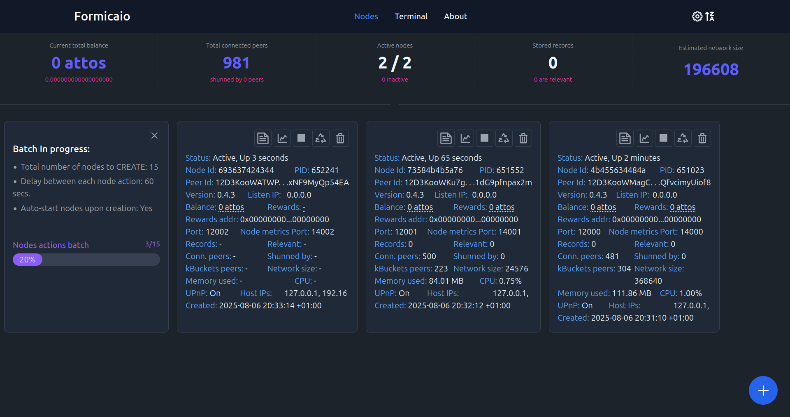
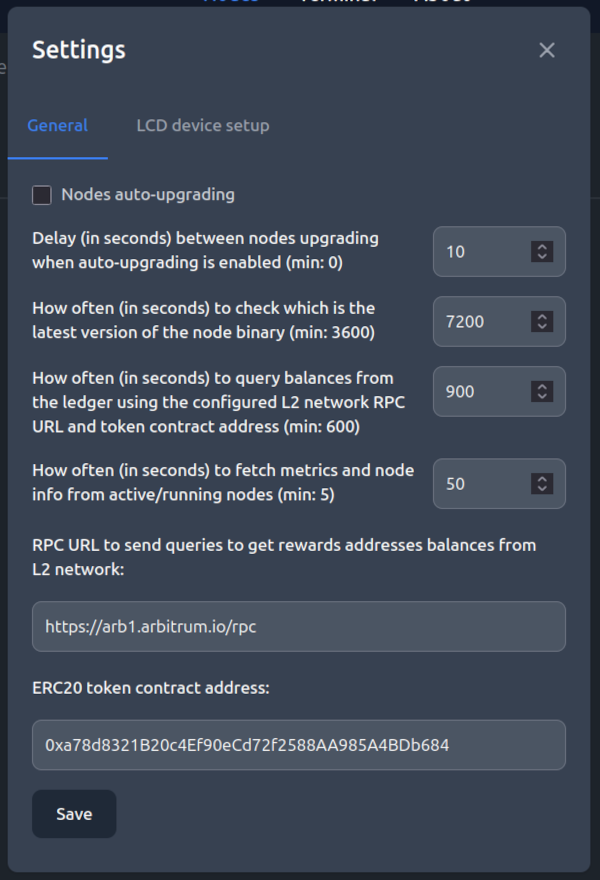

## Table of Contents

- [Introduction](#introduction)
- [How to use](#how-to-use)
- [Running a native executable on Linux, Windows, and macOS](#running-a-native-executable-on-linux-windows-and-macos)
- [UmbrelOS](#umbrelos)
- [CasaOS](#casaos)
- [Linux (amd64/arm64) with Docker](#linux-amd64arm64-with-docker)
- [Linux/Windows/MacOS (amd64/arm64) with Podman](#linuxwindowsmacos-amd64arm64-with-podman)
- [Displaying nodes stats on external LCD device](#displaying-nodes-stats-on-external-lcd-device)
- [Disclaimer](#disclaimer)
- [License](#license)

## Introduction

*Le formiche sono insetti sociali che vivono in colonie e sono note per la loro organizzazione e cooperazione.*

Ants are social insects that live in colonies and are 
known for their organization and cooperation.

#### Simplify your decentralized experience with Formicaio

Formicaio is an intuitive application designed to help you run nodes on
the [Autonomi](https://autonomi.com) network. This P2P network allows users
to share storage and bandwidth in exchange for ANT tokens, an ERC-20 token
on the Arbitrum One network (https://forum.autonomi.community/t/formicaio).

The name "Formicaio" is derived from the Italian word for "anthill"
symbolizing the collaborative and structured nature of both ants and the
decentralized network it supports. Just as ants work together to build and
maintain their colonies, Formicaio empowers users to collaborate and contribute
to the Autonomi network.

#### Node management made easy

With Formicaio, you can easily run and manage nodes using either a graphical
user interface (GUI) or a terminal. This flexibility allows you to perform
various actions on individual nodes or groups of selected nodes, including:
- Creating new nodes
- Starting or stopping nodes
- Recycling nodes to generate a new peer ID
- Removing nodes
- Upgrading nodes when a new binary version is available
- Viewing individual node logs in real time
- Monitoring memory and CPU usage with detailed charts
- Sorting nodes by different criteria, such as creation date, status, or number of connected peers


The Formicaio backend actively monitors your nodes, providing real-time
status updates and statistics, including:
- Rewards balance for each node
- Memory and CPU usage
- Number of records stored locally
- Current peer connections
- Peers in the routing table
- Peers that have shunned the node(s)
- Estimated total nodes in the network



#### Customizable monitoring and management

A settings panel allows you to customize monitoring tasks and node management, including:
- Auto-upgrading nodes when a new binary version is available
- Delay settings for node upgrades
- Frequency of version checks for the node binary
- Frequency of token balance queries
- Frequency of metrics and node information retrieval
- Configuration of the ERC20 token contract address and RPC URL for reward balance queries
- Displaying node statistics on an external LCD device (via I2C interface)



#### Connection types for nodes

When setting up nodes, you can define their connection type:
- Home-Network mode: Ideal for nodes behind a NAT without port forwarding. This mode activates hole-punching to facilitate direct connections from other nodes. If this not enabled and you're behind a NAT, nodes will struggle to connect to other peers.
- UPnP support: Attempt to use UPnP to open a port on your home router for incoming connections. If your router does not support or is not configured for UPnP, create new nodes with UPnP disabled to ensure connectivity.


## How to use

Formicaio can be deployed/executed in several ways:
- running a native executable on Linux, Windows, and macOS
- installed as an application on [UmbrelOS](https://umbrel.com) (https://github.com/getumbrel/umbrel).
- installed as an application on [CasaOS](https://casaos.zimaspace.com) (https://casaos.zimaspace.com).
- on Linux (amd64/arm64) with [Docker](https://www.docker.com) or [Podman](https://podman.io)
- on Windows/MacOS with Podman

## Running a native executable on Linux, Windows, and macOS

To launch Formicaio:
1. Download the package for your preferred platform from [latest release](https://github.com/bochaco/formicaio/releases).
2. Unzip it to your desired location.
3. Run the backed using the binary: `formicaio start` / `formicaio.exe start`

Upon startup, Formicaio will automatically download the latest node binary available. Once this process is complete, the GUI frontend will be accessible at http://localhost:52100.

The same binary can be used to run CLI commands. In order to get a list of available commands and options, simply run:
```
$ formicaio --help
```

For upgrading Formicaio, if you are already running a previous version, stop/kill the Formicaio application, download the new version and unzip it on top of the same folder where you unzipped the previous version, e.g.:
```
$ unzip -o formicaio-v<version>-<target-platform>.zip -d <path-to-existing-formicaio-folder>
```
Then simply just run the new `formicaio` / `formicaio.exe` binary from that same folder.

#### Formicaio and nodes files/data
All Formicaio and nodes files/data are stored within the same directory from which the application is executed. Please note that deleting this folder will remove all data associated with the nodes and the Formicaio database.

#### Running in the background
If you need to close the console or terminal from which Formicaio is being launched, please use a tool like [screen](https://www.shellhacks.com/linux-screen-command-run-in-background/) to keep Formicaio and its nodes running in the background. Otherwise, closing the console/terminal will stop the application and all nodes.

#### macOS and Windows Permissions
On both macOS and Windows, you may need to authorize the application to run it as unverified. For macOS users, follow [these instructions](https://support.apple.com/guide/mac-help/open-a-mac-app-from-an-unknown-developer-mh40616/mac).

**Note for macOS Users**: It is recommended to launch Formicaio from a terminal, double-clicking the executable may not work properly.

## UmbrelOS

This application has not yet been published on the official UmbrelOS app store. However, you can still install and run it on any UmbrelOS device using the [Formicaio community app store](https://github.com/bochaco/formicaio-app-store). To do this, simply add the GitHub URL (https://github.com/bochaco/formicaio-app-store) through the UmbrelOS user interface, as demonstrated in the following demo:

https://user-images.githubusercontent.com/10330103/197889452-e5cd7e96-3233-4a09-b475-94b754adc7a3.mp4

## CasaOS

You need to copy the below source link and add it to your [CasaOS](https://casaos.zimaspace.com) settings to access the this app store:

    https://github.com/bochaco/formicaio-casaos-app-store/archive/refs/heads/main.zip

Please refer to the following instructions for moe details: https://github.com/bochaco/formicaio-casaos-app-store

## Linux (amd64/arm64) with Docker

This application can also be launched on a Linux (amd64/arm64) machine using Docker Compose with the following commands:

```
$ git clone https://github.com/bochaco/formicaio
$ cd formicaio/deploy/local
$ docker compose up -d
```

Once Docker has completed pulling the images and starting the containers, the app will be running in the background, and you can access the Formicaio app from a web browser at `localhost:52100`

To see the logs you can simply use the following command:
```
$ docker compose logs -f
```

Upgrading the application (without stopping the running node instances) can be simply achieved by pulling the new Formicaio image and restarting the service:
```
$ docker compose pull formicaio
$ docker compose down formicaio
$ docker compose up formicaio -d
```

For stopping the Formicaio app and services simply run:
```
$ docker compose down
```

## Linux/Windows/MacOS (amd64/arm64) with Podman

Formicaio can be deployed and run using [Podman](https://podman.io/) instead of Docker on Linux, Windows, or macOS. To get started, you'll need to install Podman by following the instructions available at https://podman.io/docs/installation.
You can choose to install either Podman Desktop or just the command-line interface (CLI), depending on your preference and the installation options available for your platform.
Be sure to follow the installation guide specific to your operating system, which will include executing the following two commands to initialize and start the Podman machine:
```
$ podman machine init
```
...and this second command (which may or may not be necessary):
```
$ podman machine start
```

After the above steps are done, you can run Formicaio with the following commands:
```
$ git clone https://github.com/bochaco/formicaio
$ cd formicaio/deploy/local/k8s
$ podman play kube formicaio-pod.yaml
```

Once Podman has completed pulling the images and starting the containers, the app will be running in the background, and you can access the Formicaio app from a web browser at `localhost:52100`. Please note that instantiating the very first node could take a few seconds to finish since it needs to pull the node image from the internet, subsequent nodes will be much faster to instantiate afterwards.

To see the logs you can simply use the following command:
```
$ podman logs -f formicaio-pod-formicaio 
```

Upgrading the application can be simply achieved by pulling the new Formicaio image and restarting the service:
```
$ podman pull docker.io/bochaco/formicaio:latest-native
$ podman rm formicaio-pod-formicaio -f
$ podman run --name formicaio -dt -v pod_volume_formicaio:/data -e DB_PATH=/data -e NODE_MGR_ROOT_DIR=/data --pod formicaio-pod docker.io/bochaco/formicaio:latest-native
```

For stopping the Formicaio app and services simply run:
```
$ podman pod stop formicaio-pod
```

...and for starting them back again:
```
$ podman pod start formicaio-pod
```

## Displaying nodes stats on external LCD device


When running Formicaio on a Raspberry Pi, it is possible to connect an external LCD display and have Formicaio to show nodes stats on it, currently the following stats are shown:
- Formicaio version
- Estimated network size
- Number of running nodes
- Total number of stored records
- Node binary version
- Total rewards balance

You can follow the instructions in this [Raspberry Pi4 LCD setup guide](https://medium.com/@thedyslexiccoder/how-to-set-up-a-raspberry-pi-4-with-lcd-display-using-i2c-backpack-189a0760ae15) for enabling the I2C interface which is the one Formicaio supports/uses to communicate with the LCD device (you can ignore the step related to running a python example app).

As part of the setup, take note of both the configured I2C device path, e.g. '/dev/i2c-1', and the I2C address backpack detected with the `i2cdetect` tool/cmd (usually 0x27 or 0x3F), you'll need them to set up Formicaio through its settings panel.

Note that the above may not work if you are using UmbrelOS, as it has the boot path mounted as read-only. This means the tool cannot overwrite it to enable the I2C interface. The following is a workaround to this limitation, but please be aware that attempting this may pose significant risks and leave your UmbrelOS in a non-functional state. If you choose to proceed with the following workaround, be advised that it involves advanced technical commands and should only be attempted by those with a strong understanding of system configurations and potential consequences. Proceed with caution and at your own risk specially if you have important data and/or application on the device:
```
$ sudo apt install raspi-config

$ sudo umount /boot

$ sudo mount /dev/<boot-fs-device> /boot -t vfat -o rw,relatime,fmask=0022,dmask=0022,codepage=437,iocharset=ascii,shortname=mixed,errors=remount-ro

$ sudo raspi-config
```

Replacing `<boot-fs-device>` with the partition name where the /boot is originally mounted on, you can find out by running the following cmd:

```
$ mount | grep /boot

/dev/mmcblk0p2 on /boot type vfat (ro,relatime,fmask=0022,dmask=0022,codepage=437,iocharset=ascii,shortname=mixed,errors=remount-ro)
```

Once I2c was successfully enabled through `raspi-config`, reboot the Rasberry Pi, and then enable the LCD display in Formicaio through its settings panel.

## Disclaimer

Please be aware that the Formicaio backend application, as well as the `antnode` binary running within each user-created node instance (released by [Autonomi](https://autonomi.com/)), utilizes third-party RPC services to retrieve information related to the Arbitrum L2 ledger.

Specifically, the Formicaio backend application queries the RPC server at `https://arb1.arbitrum.io/rpc` to periodically check the current rewards balances for each node instance based on the configured (ETH) rewards addresses.

Risks:
- Privacy: Using third-party RPC services may expose your IP address and other metadata to those services. This means that the service provider can potentially track which addresses you are querying, which could lead to privacy concerns regarding your activity on the Arbitrum network.
- Data Exposure: Any data sent to the RPC service may be logged or monitored by the service provider, which could include sensitive information related to your node instances.

We recommend considering these risks when using the application and taking appropriate measures to protect your privacy.

## License

This project is licensed under the General Public License (GPL), version
3 ([LICENSE](http://www.gnu.org/licenses/gpl-3.0.en.html)).
